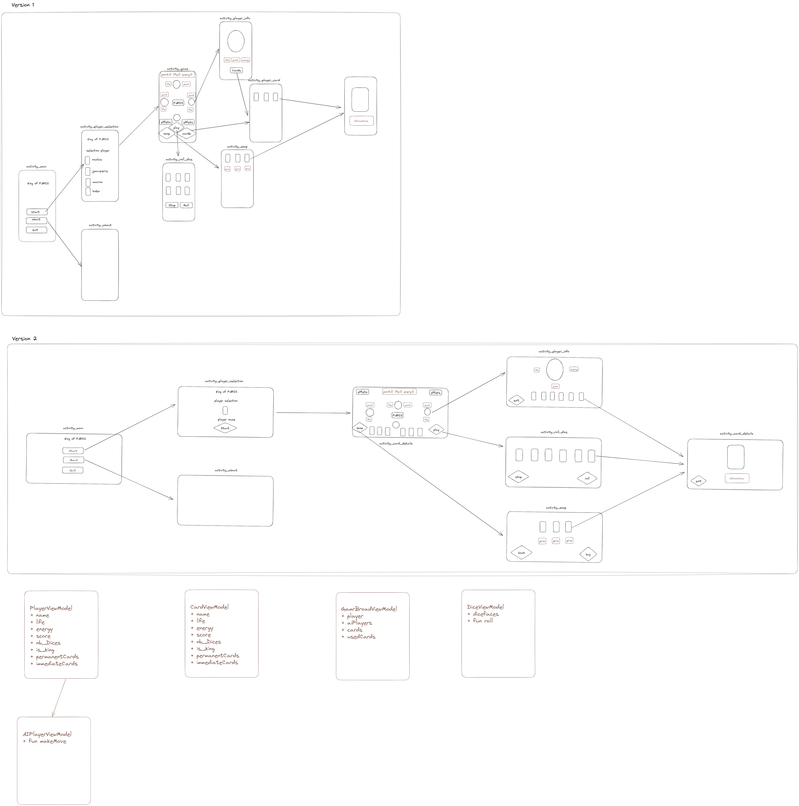

# Android_project

A. Groupes :
	 
	- Etudant 1 :
		* Nom : LEBLOND
		* Prénom : Thomas 
	
	-Etudiant 2 :
		* Nom : LE HUU
		* Prénom : Phuc
	
    - Etudant 3 :
		* Nom : GROS
		* Prénom : Théophane
	
	-Etudiant 4 :
		* Nom : Machuron 
		* Prénom : Mathilde
B. Choix des technologies :

	- Android studio: 
		* imposé par le sujet.
		* nécessaire pour faire des applications android
	
C. Architecture :
    - la version implémentée est version 2  
    

D. Sujet :

    https://www.letempledujeu.fr/IMG/pdf/king_of_tokyo.pdf 